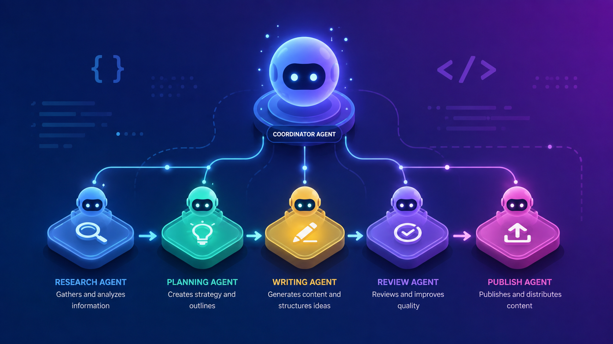

# Agent Team Setup Skill



A reusable opencode skill that scaffolds a complete team of AI agents in any project.

## Prerequisites

Before using this skill, you need to have OpenCode CLI installed.

### Installing OpenCode CLI

#### Quick Install (Recommended)

```bash
curl -fsSL https://opencode.ai/install | bash
```

#### Alternative Installation Methods

**Using npm:**
```bash
npm install -g opencode-ai
```

**Using Homebrew (macOS/Linux):**
```bash
brew install anomalyco/tap/opencode
```

**Using Chocolatey (Windows):**
```bash
choco install opencode
```

**Using Scoop (Windows):**
```bash
scoop install opencode
```

**Using Arch Linux:**
```bash
sudo pacman -S opencode           # Stable
paru -S opencode-bin              # Latest from AUR
```

**Using Mise:**
```bash
mise use -g github:anomalyco/opencode
```

**Using Docker:**
```bash
docker run -it --rm ghcr.io/anomalyco/opencode
```

#### Verify Installation

```bash
opencode --version
```

You should see the version number (e.g., `1.14.33`).

#### Configure a Provider

This skill defaults to **Cloudflare Workers AI** (`cloudflare-workers-ai/@cf/zai-org/glm-5.2`) — no OpenAI or Anthropic API keys needed. If you already have Cloudflare configured via OpenCode, you're ready to go.

To use a different provider instead:

```bash
opencode
# Then run: /connect
```

Select a provider and follow the prompts to add your API key. When you set up an agent team, tell the skill which model you want to use and it will configure all agents accordingly.

---

## Default Model & Cloudflare Integration

### Default LLM: Cloudflare Workers AI

All agents created by this skill default to:

```
cloudflare-workers-ai/@cf/zai-org/glm-5.2
```

This model runs on **Cloudflare's Workers AI Gateway** — no OpenAI or Anthropic API keys are required. The model ID is set in each agent's YAML frontmatter and in `opencode.json`.

**Want to use a different model?** Just tell the skill when you set up your team:
- "Use Claude" → agents get `anthropic/claude-sonnet-4-5`
- "Use OpenAI" → agents get `openai/gpt-4o`
- "Use my opencode provider" → agents inherit your `/connect` provider (model field omitted)

---

## What It Does

This skill helps you create production-ready agent teams for automating multi-step workflows. When you load this skill and describe your pipeline, it will:

1. **Plan** the pipeline (agents, handoffs, tools)
2. **Scaffold** the `.opencode/` directory structure
3. **Generate** the `opencode.json` coordinator config
4. **Create** subagent `.md` files with proper permissions
5. **Create** skill `.md` files for domain knowledge
6. **Create** custom tool `.py` + `.ts` pairs
7. **Create** the `AGENTS.md` project instructions file (or use `/init`)
8. **Create** custom commands for repetitive workflows (optional)
9. **Test** the pipeline end-to-end

---

## Installing This Skill

### Option 1: Clone from GitHub (Recommended)

```bash
# For global installation (available in all projects)
git clone https://github.com/bighadj22/opencode-skill.git ~/.config/opencode/skills/agent-team-setup

# Or for .agents directory
git clone https://github.com/bighadj22/opencode-skill.git ~/.agents/skills/agent-team-setup
```

### Option 2: Manual Installation

1. Download or clone this repository
2. Copy the folder to your OpenCode skills directory:

```bash
# For global installation
cp -r agent-team-setup-skill ~/.config/opencode/skills/agent-team-setup

# Or for .agents directory
cp -r agent-team-setup-skill ~/.agents/skills/agent-team-setup
```

### Option 3: Project-Specific Installation

```bash
# Install for a specific project only
cd /path/to/your/project
mkdir -p .opencode/skills
git clone https://github.com/bighadj22/opencode-skill.git .opencode/skills/agent-team-setup
```

### Verify Installation

After installation, restart OpenCode and verify the skill is available:

```bash
opencode
# Then in OpenCode, type:
# "What skills do you have?" or "List available skills"
```

You should see `agent-team-setup` in the list of available skills.

## How to Use

### Usage

In any project, load the skill and describe your workflow:

```
@skill agent-team-setup

Set up an agent team for my SaaS marketing blog:
research trending topics → write SEO articles → generate social media images → publish to WordPress
```

The skill will guide you through the entire setup process and help you make decisions about:
- Agent roles and responsibilities
- Handoff mechanisms between agents
- Custom tools needed
- Model selection and temperature settings
- Permission configurations


## What's Inside

```
agent-team-setup-skill/
  SKILL.md              # The full skill instructions (loaded by opencode)
  README.md             # This file
  references/           # Comprehensive OpenCode documentation references
    opencode-agents.md
    opencode-skills.md
    opencode-tools.md
    opencode-commands.md
    opencode-rules.md
    opencode-config.md
    opencode-permissions.md
    opencode-mcp.md
    opencode-builtin-tools.md
  templates/
    opencode.json       # Coordinator config template
    AGENTS.md           # Project instructions template
    agent.md            # Subagent definition template
    skill.md            # Skill definition template
    tool.py             # Python script template
    tool.ts             # TypeScript wrapper template
    package.json        # .opencode/ package.json
    gitignore           # .opencode/.gitignore
    requirements.txt    # Python deps template
```

## Use Cases

This skill works for any multi-step automated workflow:

- **Content Creation**: Research → Write → Edit → Publish → Promote
- **Software Development**: Analyze → Design → Code → Test → Deploy
- **Data Analysis**: Collect → Clean → Analyze → Visualize → Report
- **Customer Support**: Triage → Investigate → Respond → Follow-up
- **Marketing**: Research → Plan → Create → Schedule → Track

## Features

- **Cloudflare Workers AI by Default**: All agents use `cloudflare-workers-ai/@cf/zai-org/glm-5.2` — no API keys needed out of the box
- **Complete Setup**: Creates all necessary files and directories
- **Best Practices**: Follows OpenCode conventions and patterns
- **Comprehensive Documentation**: Includes 9 detailed reference files covering all OpenCode features
- **Flexible Architecture**: Adapts to any domain or workflow
- **Permission Control**: Proper security boundaries for each agent
- **Custom Tools**: Templates for Python + TypeScript tool integration
- **Skills System**: Knowledge documents for domain-specific guidance
- **Commands System**: Reusable prompt templates for common workflows
- **AGENTS.md Integration**: Project-level instructions with /init support

## License

MIT

