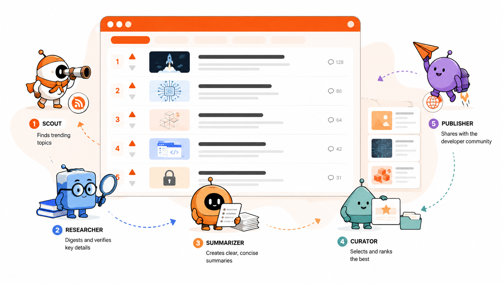

# Tech News Daily Digest Example



This directory is a complete example generated with the
[agent-team-setup skill](../SKILL.md). It uses an OpenCode agent team to turn the
current top Hacker News stories into a source-grounded daily Markdown digest.

The example is intentionally small and can be used to inspect or test the
generated OpenCode configuration before adapting the pattern to another project.

## Prerequisites

- OpenCode CLI installed and available as `opencode`
- Node.js and npm
- Python 3
- Network access to the Hacker News API and public article pages
- An authenticated OpenCode provider matching the model in `opencode.json`

The default model is `opencode/deepseek-v4-flash-free`. Change the model in
`opencode.json` and the agent files if you use another connected provider.
Keep an explicit model in every agent definition; do not rely on inheritance by
accident.

## Setup

Run these commands from this directory:

```bash
npm --prefix .opencode install
python3 -m pip install -r .opencode/requirements.txt
python3 -m py_compile .opencode/tools/fetch_hn.py .opencode/tools/scrape_articles.py
```

The Python dependencies are `requests` and `beautifulsoup4`.

## Run the Pipeline

Start OpenCode interactively:

```bash
opencode
```

Then run `/run-digest`, or ask the coordinator for a daily digest. The complete
pipeline can also be started non-interactively:

```bash
opencode run "/run-digest"
```

The default run processes exactly 10 current, URL-bearing Hacker News stories.
For testing, explicitly request a smaller limit in the digest request. The
scout accepts limits from 1 through 50.

## Pipeline

The coordinator delegates each stage in order:

1. `scout` fetches ranked stories from the public Hacker News Firebase API.
2. `researcher` retrieves and extracts text from each article URL.
3. `summarizer` creates source-grounded two- or three-sentence summaries.
4. `curator` formats the summaries into a Markdown draft.
5. `publisher` validates the draft and writes the final digest.

Each stage passes an exact file path to the next stage:

| Stage | Handoff or output |
|---|---|
| Scout | `.opencode/workspace/data/{date}-hacker-news.json` |
| Researcher | `.opencode/workspace/research/{date}-articles.json` |
| Summarizer | `.opencode/workspace/briefs/{date}-summaries.json` |
| Curator | `.opencode/workspace/drafts/{date}-daily-digest.md` |
| Publisher | `output/{date}-daily-digest.md` |

Dates use UTC in `YYYY-MM-DD` format. Article fetch failures are preserved as
explicit unavailable records; the agents do not invent replacement summaries.

## Repository Layout

| Path | Purpose |
|---|---|
| `opencode.json` | Project configuration and coordinator agent |
| `.opencode/agents/` | Pipeline subagent definitions |
| `.opencode/commands/run-digest.md` | Reusable digest command |
| `.opencode/skills/` | Source-research and digest-formatting rules |
| `.opencode/tools/` | Hacker News and article-fetching tools |
| `.opencode/requirements.txt` | Python tool dependencies |
| `.opencode/workspace/` | Runtime handoffs between agents |
| `output/` | Published Markdown digests |

Runtime workspace files and local dependencies are excluded by
`.opencode/.gitignore`. The publisher's files in `output/` are the final example
artifacts intended for review or publication.
